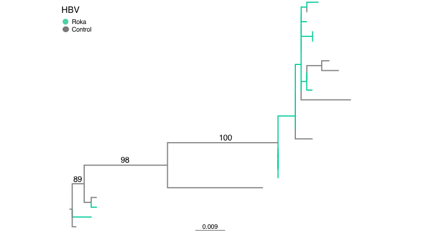

## HBV

We performed a supplemental maximum likelihood analysis of HBV sequences from the Roka outbreak. Tree files in `.nexus` format and stdout files are in this repo, along with PDF versions of the figures.

ML tree of HBV sequences

