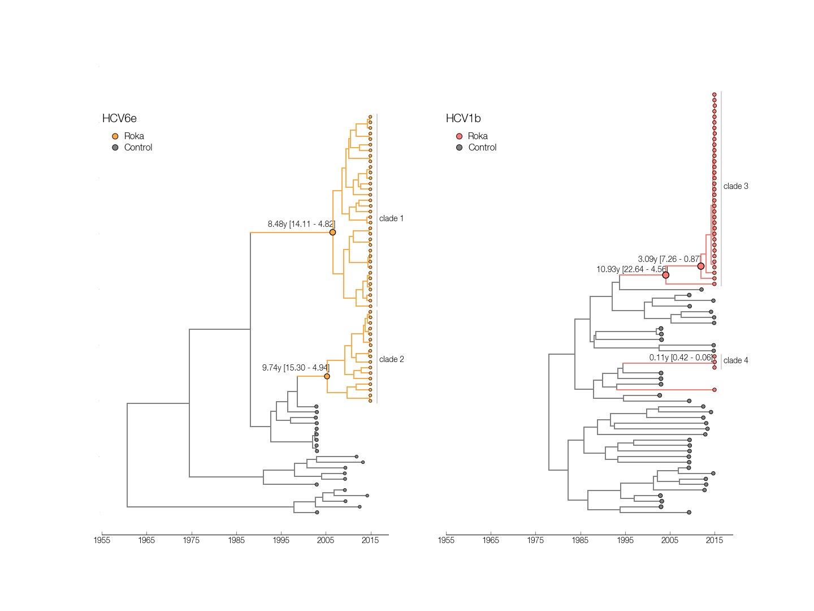

## Temporally resolved phylogenies for HCV

This directory contains files for inferring temporally-resolved phylogenetic trees of HCV1b and HCV6e. A PDF version of the figure shown below is also saved here.

