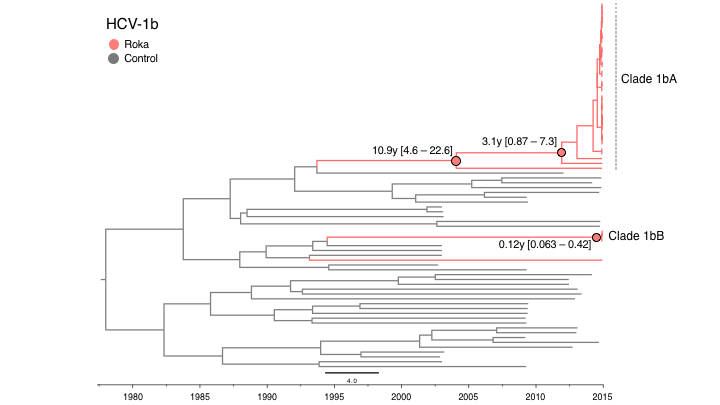
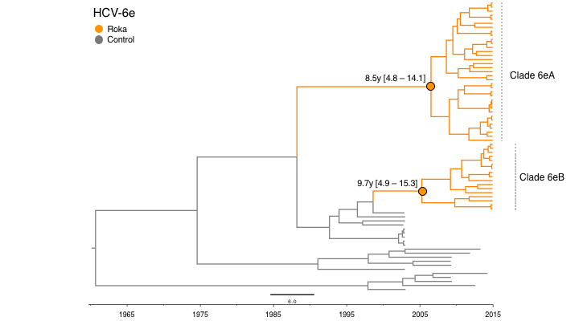

## Temporally resolved phylogenies for HCV

This directory contains files for inferring temporally-resolved phylogenetic analysis of HCV1b and 6e. PDF versions of the figures shown below are also saved here.

#### ML tree for HCV1b

#### ML tree for HCV6e

