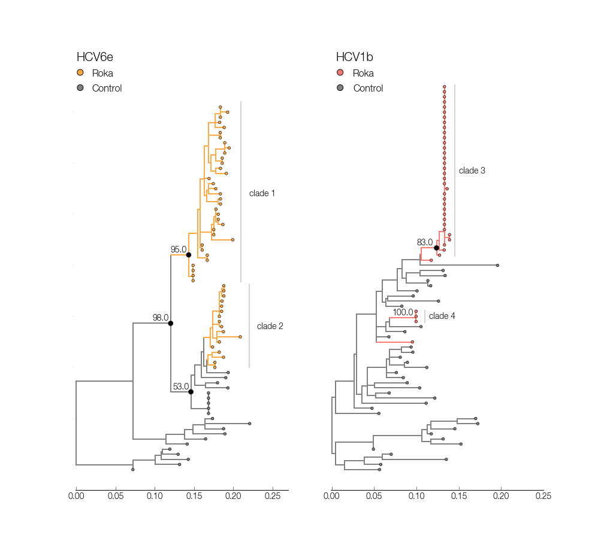

## Maximum likelihood phylogenies for HCV

This directory contains files for inferring maximum likelihood phylogenies for HCV1b and HCV6e. Files with `bootstrap` are the highest likelihood trees from raxml with bootstrap support values for all nodes in the tree. Files with `figtree_reroot` are the same files but have been re-rooted with the best fitting root (as determined in path-o-gen). These are the input files used for the figure creation.

#### ML tree for HCV1b and HCV6e

