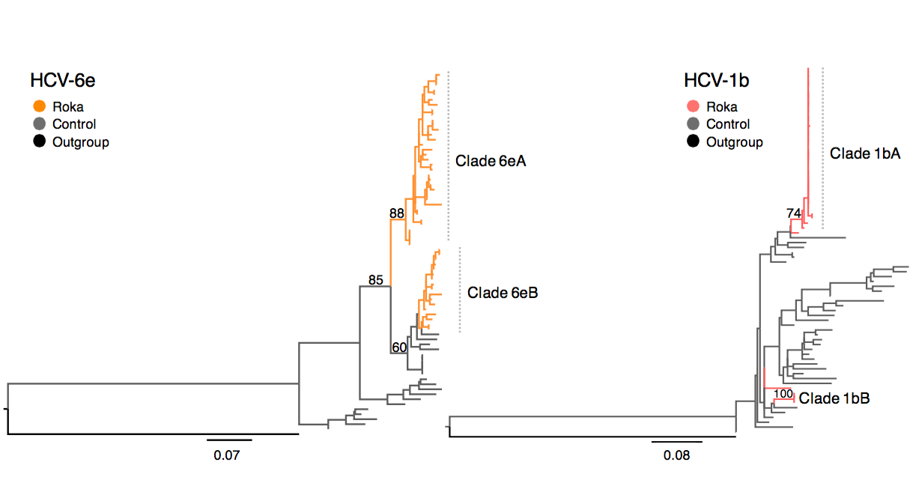

## Maximum likelihood phylogenies for HCV

This directory contains files for inferring maximum likelihood phylogenies for HCV1b and HCV6e. Files labelled as `besttree` represent the tree with the highest likelihood. Files with `bootstrap` have bootstrap support values for all nodes in the tree. Figures show bootstrap support values for key nodes. PDF versions of the figures shown below are also saved here.

The outgroup is an HCV1h sequence [GenBank Accession FJ872355](https://www.ncbi.nlm.nih.gov/nuccore/FJ872355).

#### ML tree for HCV1b and HCV6e

