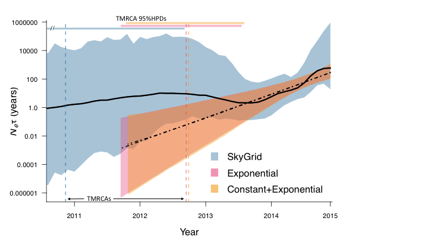

## Inference of changes in effective HIV population size in Roka

We jointly inferred phylogenetic relationships, evolutionary rate, and demographic parameters among Roka HIV-Env sequences using three demographic models acting as coalescent priors on phylogeny structure: a Bayesian SkyGrid non-parametric model of population size change, an exponential growth model, and a model allowing a period of constant population size followed by exponential growth (constant + exponential).

The following types of files are available in this directory:
* `.xml` files are the input files for the joint inference performed in BEAST
* `.log` files contain the logged draws from the posterior distribution for various parameter values
* `.tsv` files contain the mean, median, upper HPD, and lower HPD values of Ne used to make the skyline plot

[This script](/roka/Scripts/R_scripts/SkylinePlotCode_roka.R) was used to plot the figure.

#### Skyline plot

