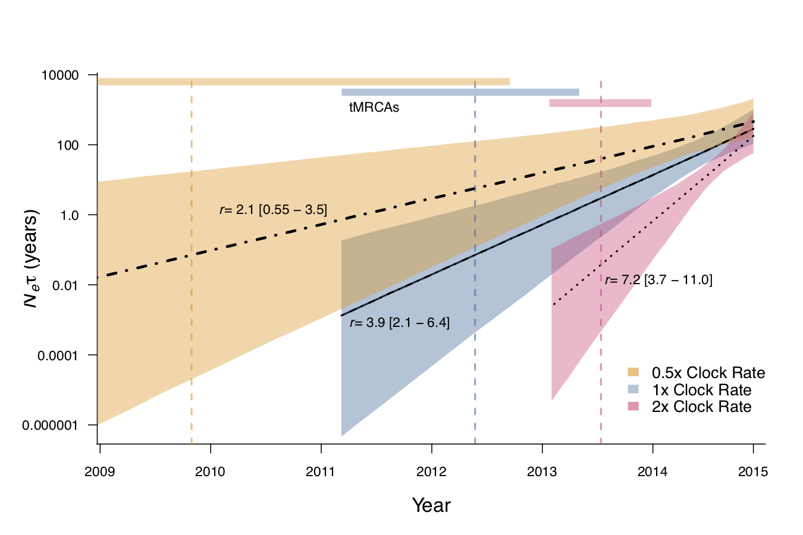

## Inference of changes in effective HIV population size in Roka

We jointly inferred phylogenetic relationships, evolutionary rate, and demographic parameters among Roka HIV-Env sequences using three demographic models acting as coalescent priors on phylogeny structure: a Bayesian SkyGrid non-parametric model of population size change, an exponential growth model, and a model allowing a period of constant population size followed by exponential growth (constant + exponential).

We additionally conducted a sensitivity analysis to look at the robustness of population size inference under an exponential growth demographic model to changes in the clock rate prior, which is an informed prior.

The following types of files are available in this directory:
* `.xml` files are the input files for the joint inference performed in BEAST
* `.log` files contain the logged draws from the posterior distribution for various parameter values
* `.tsv` files contain the mean, median, upper HPD, and lower HPD values of Ne used to make the skyline plot

[This R script](/Scripts/R_scripts/SkylinePlotCode_roka.R) was used to plot the posterior distributions of NeTau under three different models, as shown below. Input data are `tsv` files, and they can all be found [here](/HIV/bayesian_skyline).

[This other R script](/Scripts/R_scripts/ClockRateSensitivityAnalysis.R) was used to plot the posterior distributions of NeTau under three different clock models.

