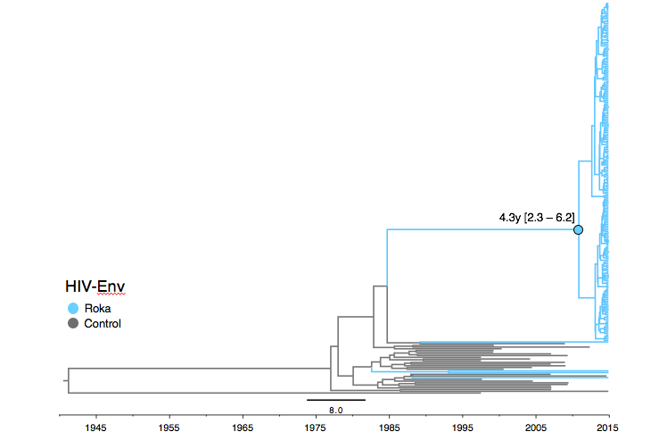

## Temporally-resolved phylogenies for HIV-Env

This directory contains files for inferring temporally-resolved phylogenetic trees HIV-Env. PDF versions of the figures shown below are also saved here.

* The `.trees` file contains 2000 trees representing independent draws for the posterior distribution of trees.
* The `.mcc` file is the maximum clade credibility tree constructed from the 1600 posterior trees (400 trees burned-in)

#### Time-tree for HIV-Env

