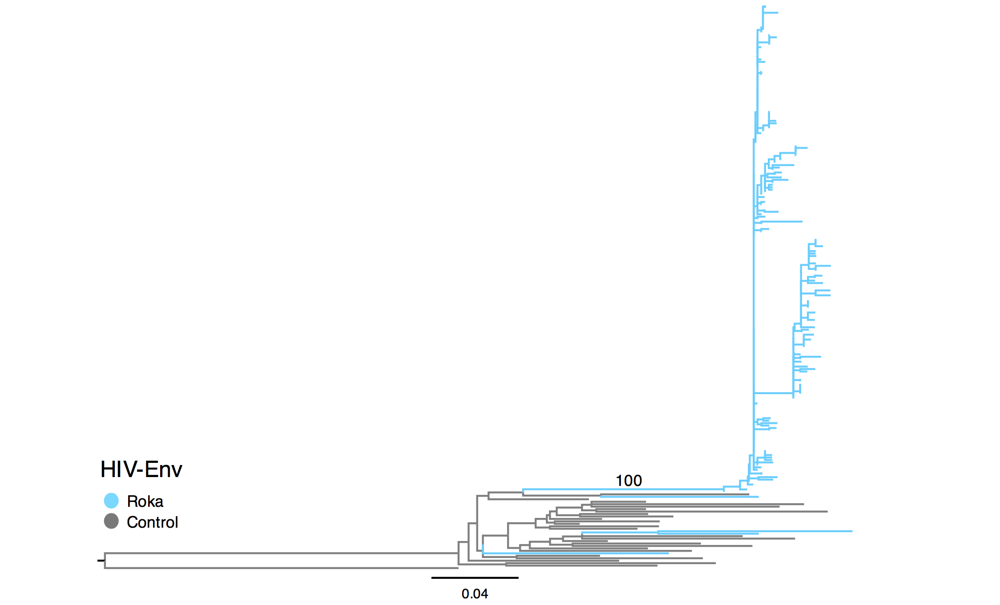
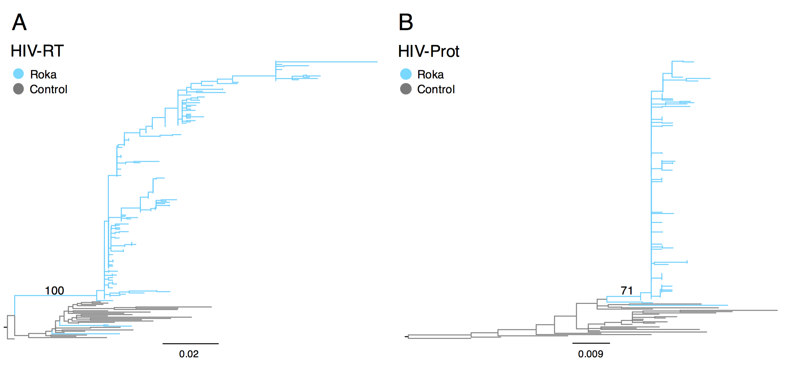

## Maximum likelihood analysis of HIV-Env, HIV-Prot, and HIV-RT sequences.

From Roka there were 203 HIV-Env sequences and 192 HIV-Prot and HIV-RT sequences. All maximum likelihood analyses were run with gene sequences from the same 27 control samples. The goal of this analysis was to differentiate HIV incident HIV infections spread due to iatrogenic transmission (outbreak-related infections) from prevalent HIV infections that were not related to the outbreak but were discovered during enhanced surveillance.

Within this directory all tree files are `.nexus`. Files labelled as `besttree` represent the tree with the highest likelihood. Files with `bootstrap` have bootstrap support values for all nodes in the tree. Figures show bootstrap support values for key nodes. PDF versions of the figures shown below are also saved here.

#### ML tree for HIV-Env

#### ML tree for HIV-RT and HIV-Prot

* From analysis of Env sequences: `NCHADS116`, `NCHADS171`, `NCHADS184` and `NCHADS185` cluster within control sequences. All other Roka viruses are monophyletic and closely related.

* From analysis of RT sequences: `NCHADS171`, `NCHADS184` and `NCHADS185` cluster within control sequences. All other Roka viruses are closely related. This agrees with what we find from the env sequences. `NCHADS116` did not have a sequence for RT.

* From analysis of the Prot sequences:  `NCHADS171`, `NCHADS184` and `NCHADS185` cluster within control sequences. All other Roka viruses are closely related. This agrees with what we find from the env and prot sequences. `NCHADS116` did not have a sequence for prot.
