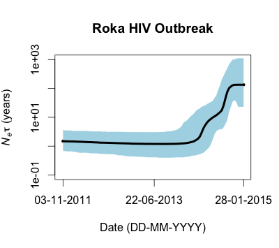
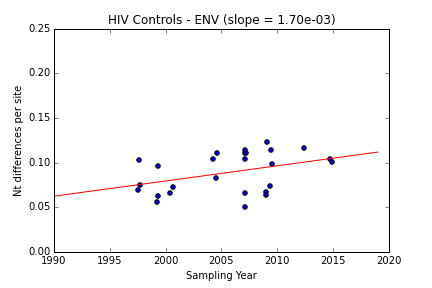
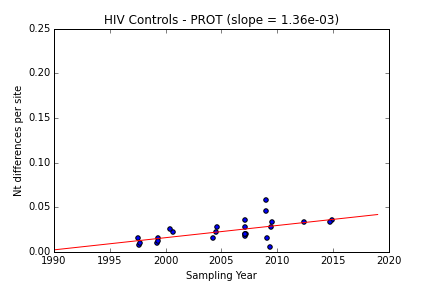
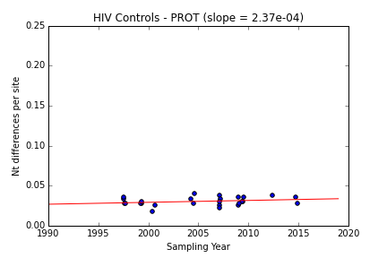
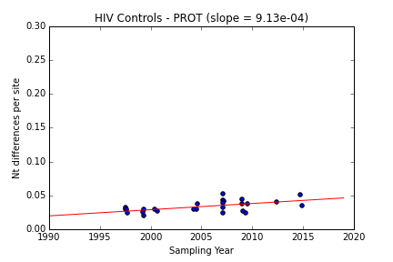
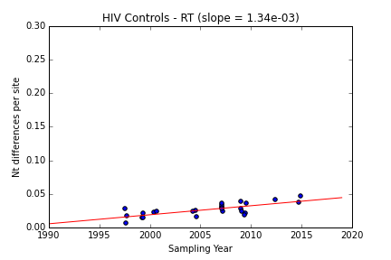

# BEAST coalescent analysis

Repo for coalescent trees and skyline plots generated by BEAST 1.8.2.

## Env-only analysis notes:

* Roka viruses `NCHADS116`, `NCHADS171`, `NCHADS184` and `NCHADS185` cluster within control sequences and are not included.

* The clock prior used is based on the posterior distribution of clock.rate from the log files originally sent from Francois and colleagues [here](https://github.com/blab/roka/tree/master/FrancoisData). In these files, the rates were in DAYS. Log files were exported to R where the rates were converted to years (multiplied by 365) using [this R script](https://github.com/blab/roka/blob/master/Scripts/R_scripts/clockprior_daytoyear.R). Mean and standard deviation were calculated on the yearly rate data and parameterize the prior distribution on the clock rate (N ~(0.004912, 0.0006632)).

* MCC tree is based on 2000 samples from the posterior with 400 tree burn-in.

* Sampling time 0.0 is January 28, 2015

* For skyline plot, the plotted values are the median population sizes. The plot runs from time 0 to the mean estimate of TMRCA.

* Mean TMRCA is 3.235 years, which puts common ancestor at 2011-11-04 (95% CI between 2009-12-31 and 2013-04-25).

* For the logistic growth model we changed the default priors on logistic.t50 and the logistic.growthRate. We don't know where on the logistic growth curve we are (population may still be growing exponentially and t50 hasn't been reached yet, or t50 may have already occurred). To accommodate this the lower on the t50 prior was changed to -10 (allowing t50 to occur up to 10 years in the future). Note that positive values of t50 would represent n years back in time (the present is 0). For logistic.growthRate the prior is a normal distribution (N~(0,10)) with initial value 0.

    `<uniformPrior lower="-10" upper="10">`
    `   <parameter idref="logistic.t50"/>`
    `</uniformPrior>`

* BEAST will not run a logistic growth model in which t50 is negative. UPDATE: This is unfortunate because analysis of the logistic run shows that the highest density of the t50 estimate is pushed to 0 (you can see this by looking at the t50 estimates from the log file in Tracer). This indicates that the t50 probably really is in the future. Since logistic growth can't accomodate this we'll need to switch to an exponential demographic model.

#### Figures

Maximum Clade Credibility (MCC) tree

Skyline plot to look at changes in viral population size over time.

## Env + prot + RT analysis 

### Prior elicitation for the molecular clock

The molecular clock is not well estimated from the Roka samples because there is very little temporal spread (all samples were taken within roughly a two week window). Therefore we need to use a fairly informative prior on the clock rate. To estimate what this prior distribution should be we are estimating the clock rate from HIV control sequences (for Env, Prot, and RT) sampled over a greater time span from SE Asia. 

While we might expect the clock to be slightly different on the time scale of an epidemic (when there's not enough time for purifying selection to reduce the mutation load) than over the time scale of 10-15 years, there's not a great dataset to use for prior elicitation at the epidemic level. The scale we are working at should be a decent approximation.

#### Root-to-tip divergence for different genes (as estimated in Path-O-Gen)

Slope of the regression line estimates the rate of a strict clock and correlation coefficient presents an estimate of the variation in the data accounted for by the regression. All estimates use best fitting root.

* Env: Slope(rate) = 2.8954E-3, Correlation Coefficient = 0.5037

* Prot: Slope(rate)	= 9.711E-4, Correlation Coefficient	= 0.4673

* RT: Slope(rate) = 9.0201E-4, Correlation Coefficient = 0.5559

#### Raw nt differences per site plotted against sampling date for different genes

Again, slope of the regression line provides an estimate of the evolutionary rate. Here divergence is simply the number of nt differences between the reference sequence and all other sequences in the alignment divided by the sequence length (to get number of nt differences per site). Calendar dates were parsed as numbers in Path-O-Gen and used as the date information in these plots. The reference sequence is the outgroup from the ML tree fit in a Path-O-Gen analysis with the best fitting root. Gaps and ambiguous bases (coded with IUPAC codes) are treated as missing data and do not contribute to counts of nt differences. The code for making the plots is [in this iPython notebook.] (https://github.com/blab/roka/blob/master/HIV_data/control_only/NtDiff_Dates_RokaControls.ipynb)

###### NOTE: For RT and Prot it wasn't completely clear which taxon was the outgroup. Using different reference sequences does cause the rate to change (see the sensitivity analyses for prot and RT). Just looking at the ML trees in FigTree H0725135 looks like it should be the outgroup for all the genes, but when using the best fitting root in Path-O-Gen other taxa group out (and are shown as additional clock plots)

* Env

With H0725135 as the outgroup:

* Prot

With H0725135 as the outgroup:

With R0222042 as outgroup:

With T0527136 as outgroup:

* RT

With H0725135 as the outgroup:

With R0222042 as outgroup:

With W0530014 as outgroup:

#### Molecular clock estimation from control sequences using BEAST

BEAST analyses to estimate the posterior distribution of the evolutionary rate were conducted using the following models and priors:

* HKY with Gamma (4) rate variation between sites as the evolutionary model

* Bayesian Skyline with 10 intervals as the demographic model

* Strict molecular clock with a CTMC Rate Reference (non-informative) prior with starting value of 1E-4. All other priors were left at default.

* MCMC was run for 100 million generations logging every 50 000 steps (producing a posterior of 2000 trees).

##### Clock.rates from BEAST analysis:
* Env: mean	3.8278E-3, 95% HPD 2.7243E-3, 5.1582E-3
* Prot: mean 1.2203E-3, 95% HPD 6.0925E-4, 1.8942E-3
* RT: mean	1.0814E-3, 95% HPD 6.8573E-4, 1.514E-3
