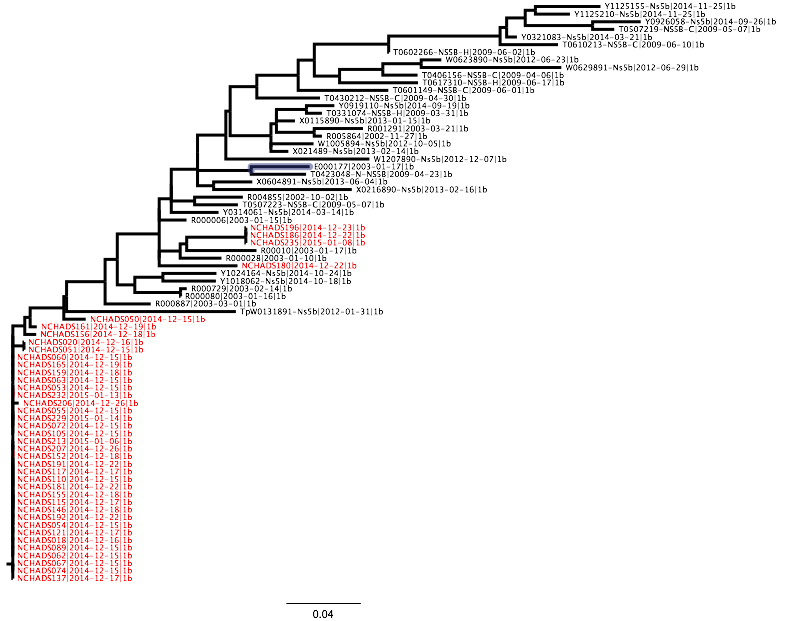
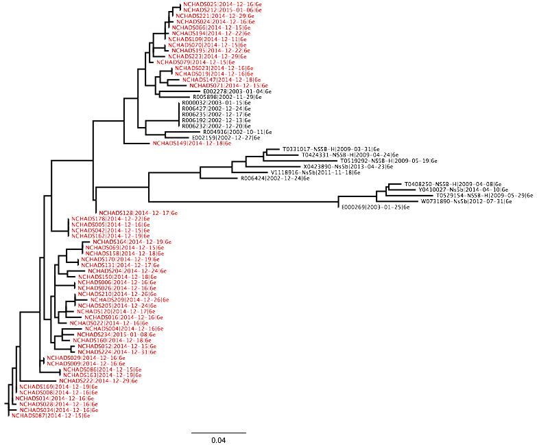

# Maximum Likelihood Trees

Repo for `.newick` maximum likelihood trees generated by RAxML.

# HIV

* RAxML recognized the pipe as an argument delimiter, so for the ML tree of just the Roka sequences the outgroup taxa 
name had underscores used instead. Example: `>NCHADS124|env|roka|2014-12-17` became `>NCHADS124_env_roka_2014-12-17`.

* Roka viruses `NCHADS116`, `NCHADS171`, `NCHADS184` and `NCHADS185` cluster within control sequences. All other Roka 
viruses are monophyletic and closely related.

* Roka virus `NCHADS124` is basal to the rest of the Roka clade.

## Figures

Roka outbreak sequences rooted by `NCHADS124`.

# HCV

* Sequences that were sampled from Roka are indicated by an NCHADS indentifier and are highlighted in red.

## Roka and Controls using 1b

## Roka and Controls using 6e
