# Maximum Likelihood Trees

-------------------------------------

# HIV

## Controls

### Control sequences show topological incongruency across Env, Prot, and RT

* Env controls (taxa that group together are colored the same)

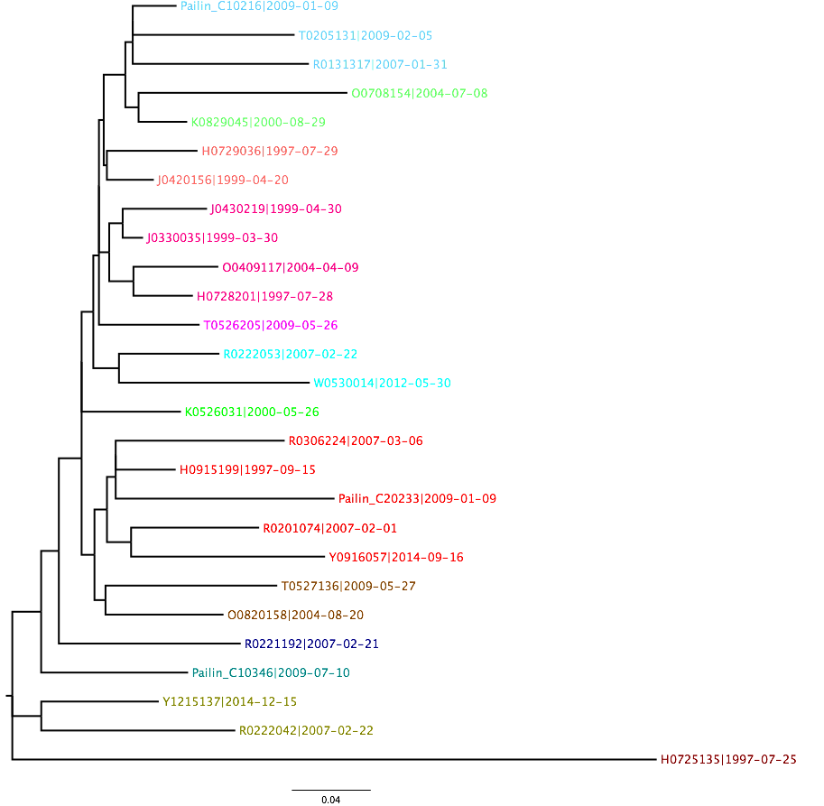

* Prot controls (taxa are colored the same as in env tree, note that like colors do not group)

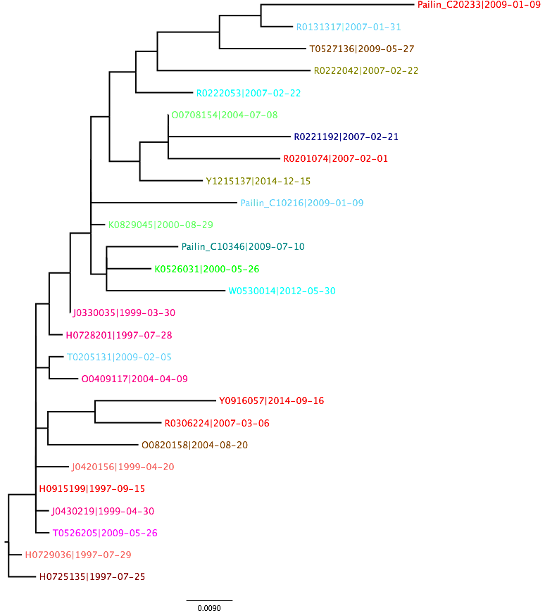

* RT controls (taxa are colored the same as in env tree, note that like colors do not group)

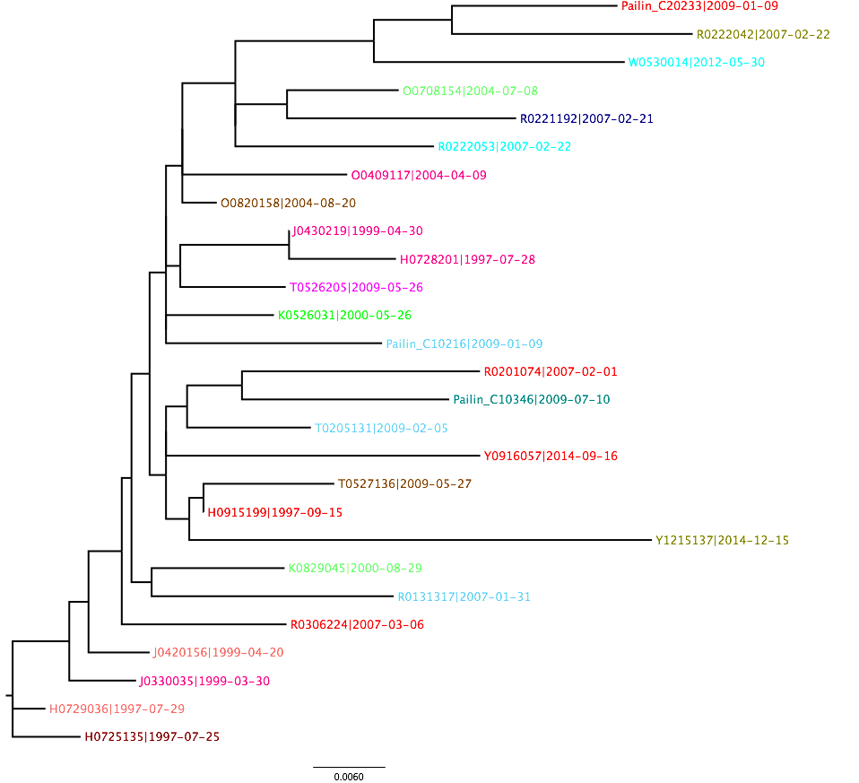

## Roka and controls combined

There are some sequences that were sampled in Roka during the outbreak investigation that group with control sequences as opposed to with the rest of the Roka outbreak. These infections were likely prevalent infections that were not iatrogenically transmitted. Thus they are removed from the Roka sequence set in the Roka outbreak analyses. To find these samples we have inferred trees from alignments of the Roka sequences and controls together.

*From analysis of Env sequences: `NCHADS116`, `NCHADS171`, `NCHADS184` and `NCHADS185` cluster within control sequences. All other Roka viruses are monophyletic and closely related.

*From analysis of RT sequences: `NCHADS171`, `NCHADS184` and `NCHADS185` cluster within control sequences. All other Roka viruses are closely related. This agrees with what we find from the env sequences. `NCHADS116` did not have a sequence for RT.

*From analysis of the Prot sequences:  `NCHADS171`, `NCHADS184` and `NCHADS185` cluster within control sequences. All other Roka viruses are closely related. This agrees with what we find from the env and prot sequences. `NCHADS116` did not have a sequence for prot.

## Roka sequences only

Env, Prot and RT trees show topological incongruence (clusters are colored the same color in the Env tree, we do not see the same colors grouping together in the RT and the Prot sequences). I think that this is probably happening because the sequences do not all have the same level of informativeness (note for instance the scale on Prot).

* Env

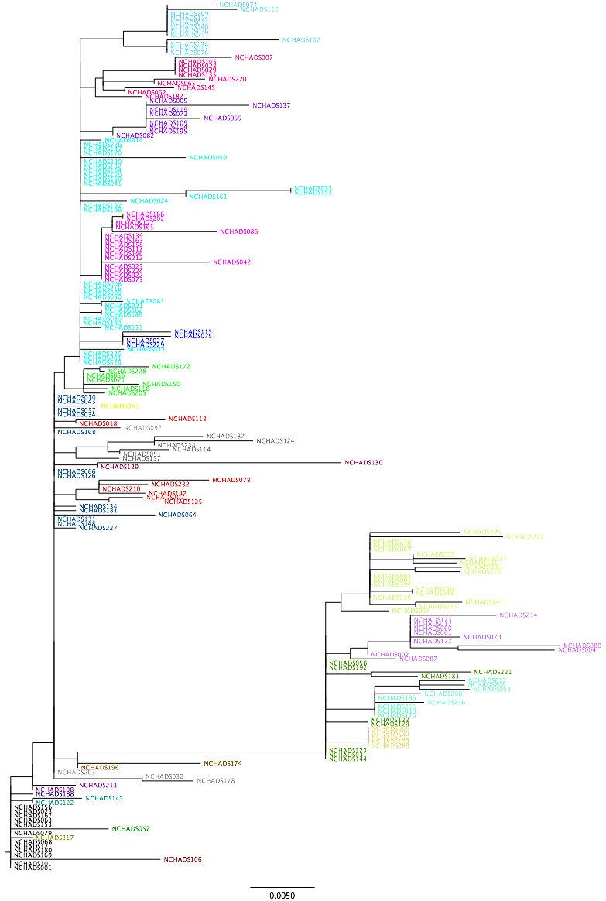

* Prot

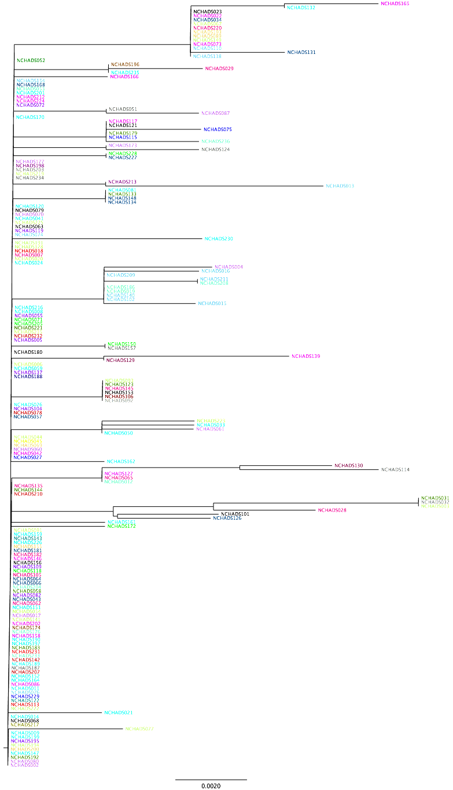

* RT

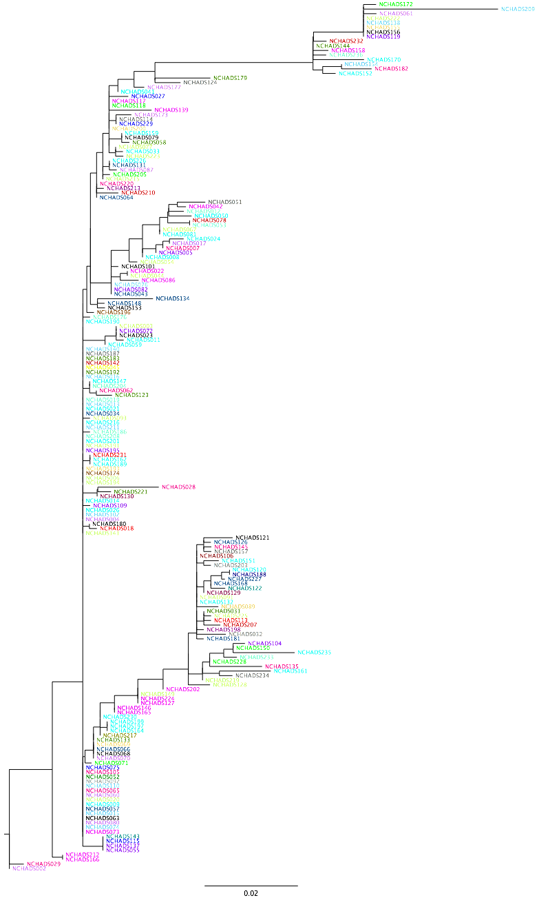

---------------------------------------------------------

# HCV - figures and interpretation

* Sequences that were sampled from Roka are indicated by an NCHADS indentifier and are highlighted in red.
* For rooted trees, the outgroup sequence is highlighted in blue

## Unrooted ML tree of Roka and control samples from NS5B sequences of HCV Genotype 1b
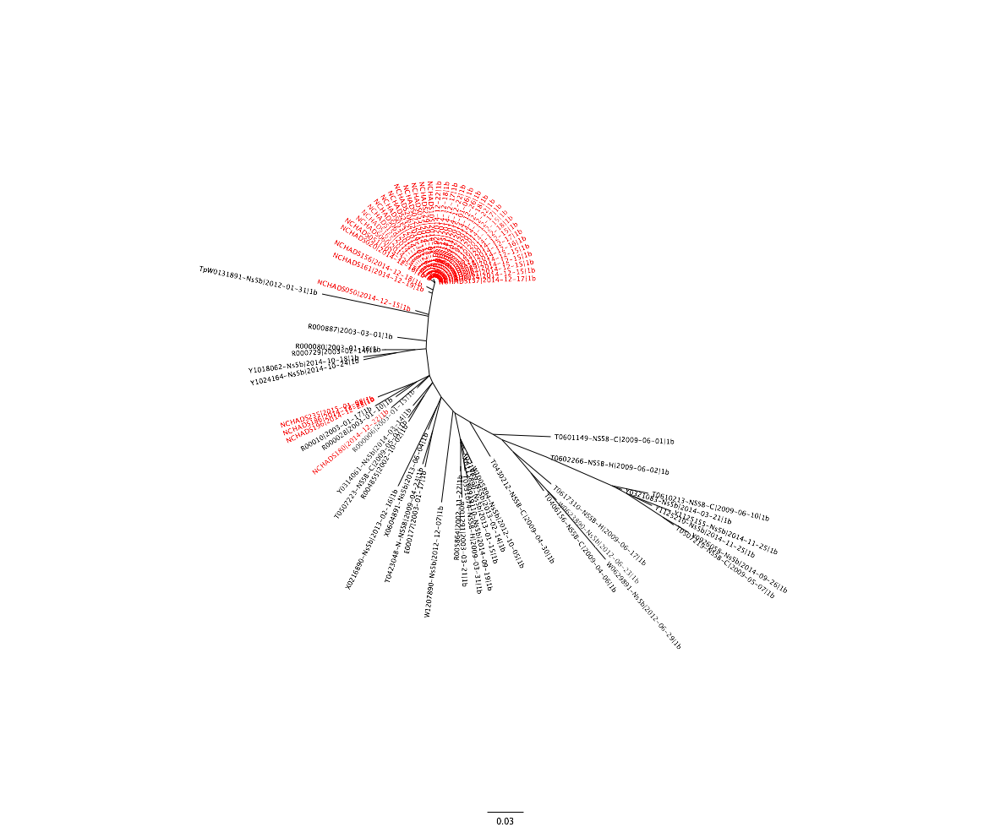

## ML tree of Roka and control samples for HCV 1b, rooted based on outgroup FJ872355 (HCV1h)
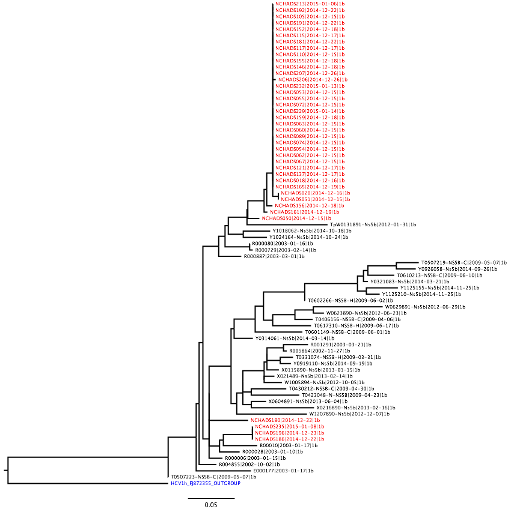

## Same ML tree of HCV1b (Roka and Controls) but with bootstrap values on the branches
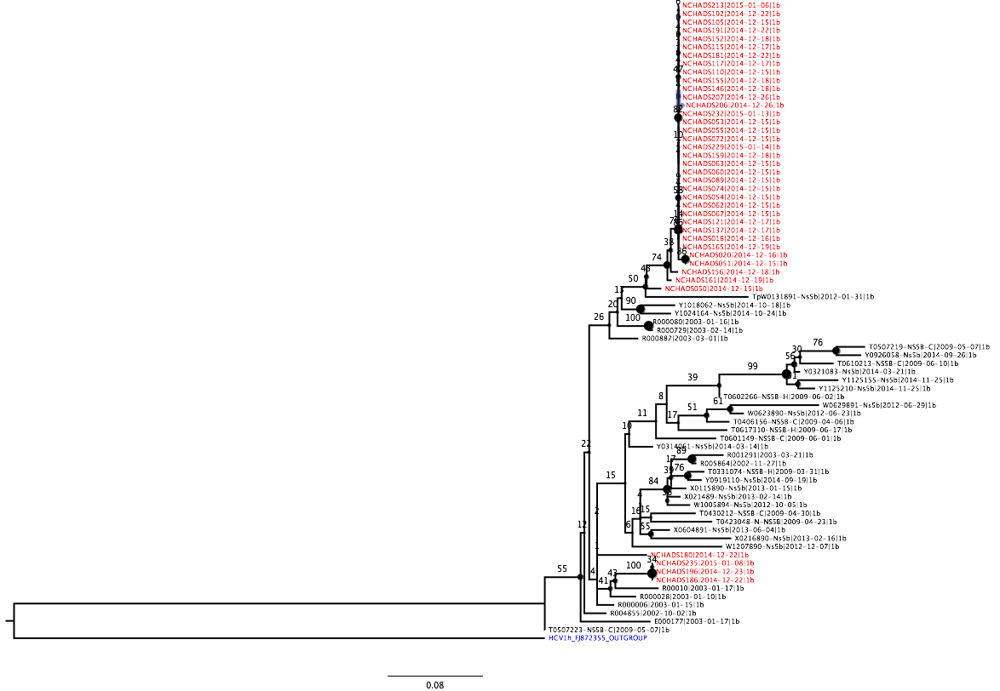

Here we find evidence of at least two introductions of HCV-1b into the Roka community at some point in time, with substantial propagation of one of the introduced clades, likely due to needle re-use given the exceptionally low amount of diversity seen within the clade. The two clades of HCV-1b circulating in Roka appear to be 1) NCHADS196, 186 and 235, and 2) all other Roka sequences. While NCHADS180 doesn't appear to group with other Roka sequences the bootstrap support is low. We note that more clades could become apparent with the inclusion of more control sequences. For instance NCHADS050, 161 and 156 group basally with the highly propagated clade, but are slightly more divergent than the rest of the sequences grouping within this clade. Therefore it is possible that 050, 161, and 156 represent more divergent members of this clade, or that they would form another clade if more control sequences were included and showed interdigitation with 050, 161 or 156. 

## Unrooted ML tree of Roka and Control samples from NS5B sequences of HCV Genotype 6e
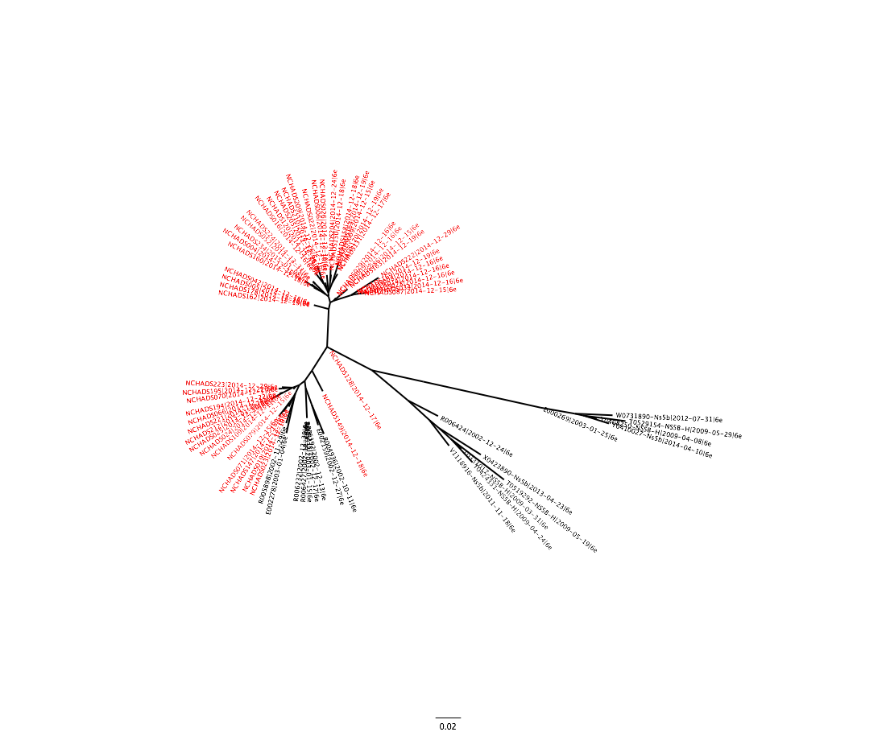

## ML tree of Roka and control samples for HCV 6e, rooted based on outgroup FJ872355 (HCV1h)

## Same ML tree of HCV6e (Roka and Controls) but with bootstrap values on the branches
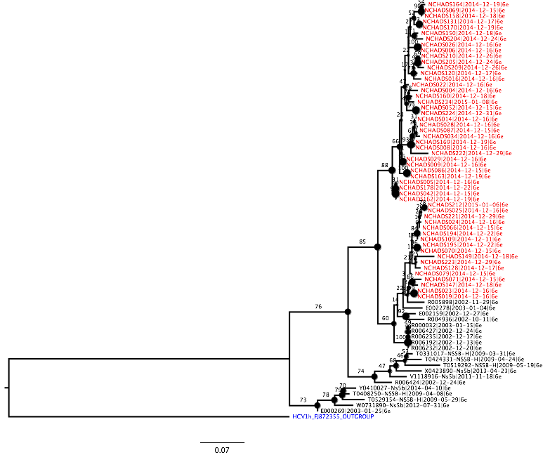

The HCV-6e tree also indicates two clades that were propagated by needle re-use. There is generally more diversity within the major Roka clades, and there are multiple subclades of 2-4 taxa that group together with strong support. We probably don't want to read too much into this, but a possible hypothesis is that HCV-6e infections were propagated slower over more time, allowing more diversity to accrue, whereas the HCV-1b tree appears to be more consistent with major propagation right before sampling (thus not leaving much time for diversity to build).