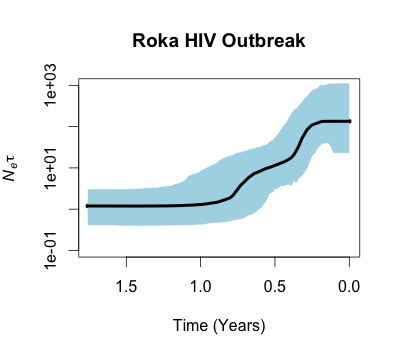

# BEAST coalescent analysis

Repo for coalescent trees and skyline plots generated by BEAST 1.8.2.

## Notes

* Roka viruses `NCHADS116`, `NCHADS171`, `NCHADS184` and `NCHADS185` cluster within control sequences and are not included.

* The clock prior used is based on the posterior distribution of clock.rate from the log files originally sent from Francois and colleagues. In these files, the rates were in DAYS. Log files were exported to R where the rates were converted to years (multiplied by 365). Mean and standard deviation were calculated on the yearly rate data and parameterize the prior distribution on the clock rate (N ~(0.004912, 0.0006632)).

* MCC tree is based on 2000 samples from the posterior with 400 tree burn-in.

* Sampling time 0.0 is January 28, 2015 (still working on transition to calendar dates for skyline plot)

## Figures

MCC tree

Skyline plot

