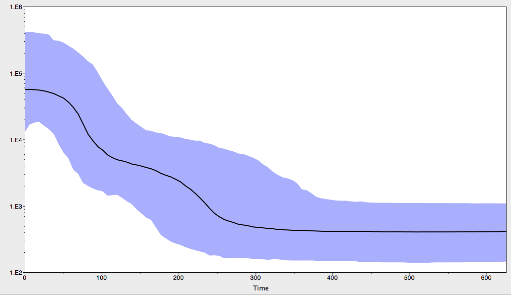

# BEAST coalescent analysis

Repo for coalescent trees and skyline plots generated by BEAST 1.8.2.

## Notes

* Roka viruses `NCHADS116`, `NCHADS171`, `NCHADS184` and `NCHADS185` cluster within control sequences and are not included.

* Time is in days.

* MCC tree is based on 2000 samples from the posterior with 400 tree burn-in

## Figures

MCC tree

Skyline plot

