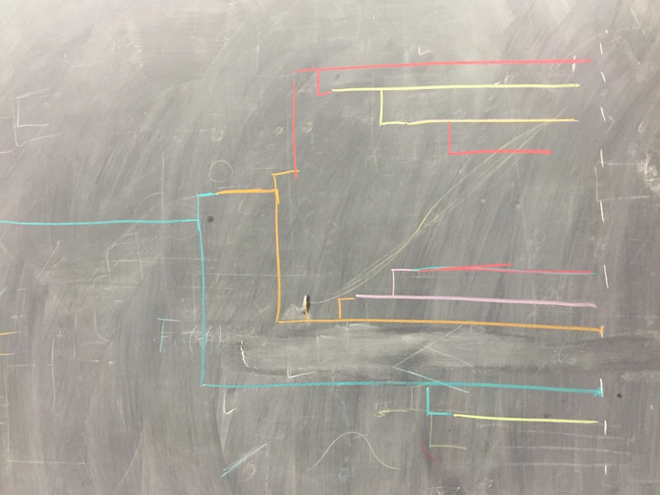

We expect the founding infection to be the outgroup infection (here in blue). In this case, we'd hypothesize that the founding infection also had a secondary tranmission event resulting in a single secondary infection.

